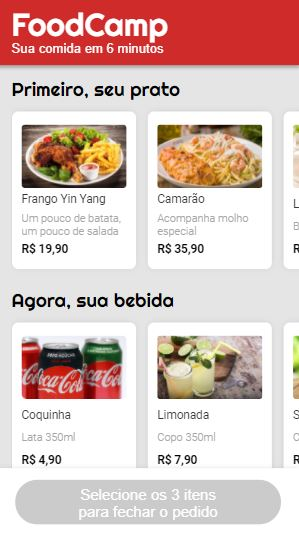
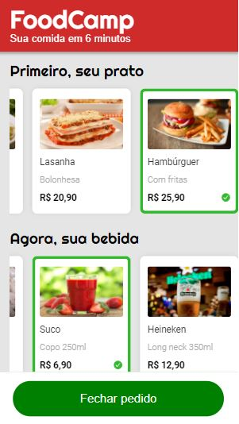
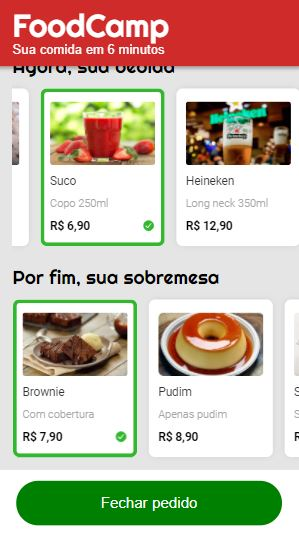
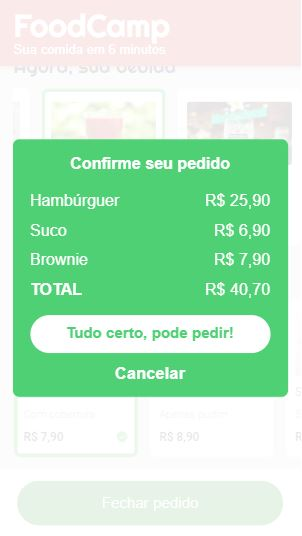
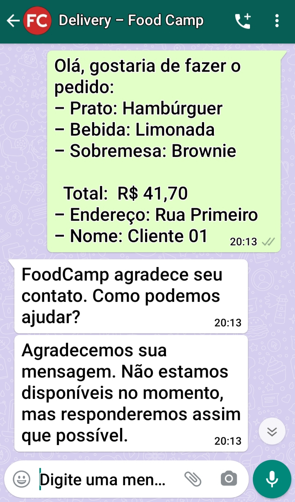

<h1 align="center">
 
  
 
 
Site mobile do FoodCamp 🍔🥤
</h1>

Implementação do site mobile do FoodCamp, um restaurante especial que entrega seu pedido em 6 minutos. O site permite de forma fácil a escolha do seu combo, enviando em seguida o pedido por WhatsApp diretamente para o restaurante.

  Esse é o meu primeiro projeto com JavaScript no treinamento do bootcamp "Desenvolvimento Web Full-Stack" do Responde Aí

  Acesse o site <a href="https://julianadfreitas.github.io/Projeto_03_FoodCamp/"> aqui </a>

  
  
  
  
  
  

[//]: # (Add the features of your project here:)
### Página desenvolvida utilizando CSS, HTML e JavaScript.

### Funcionalidades:
- Lista dos pedidos com scroll horizontal;
- Janela de confirmação do pedido e encaminhamento do mesmo para o whatsapp com mensagem pronta.

### Conhecimentos:
- Para a organização do layout: 
 Flex-Box, 
 ícones da biblioteca Ionicons;
- JavaScript: prompt, .querySelector, Position Fixed
